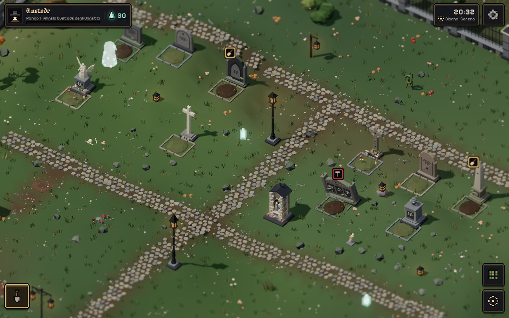
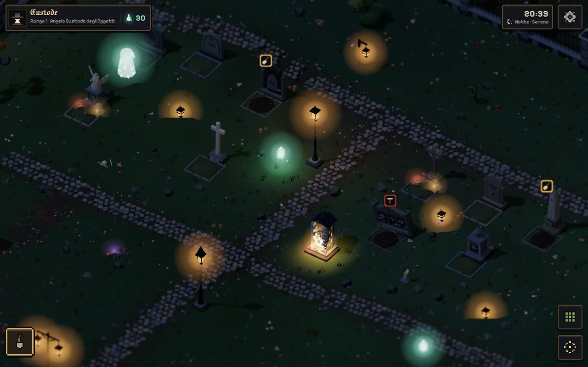
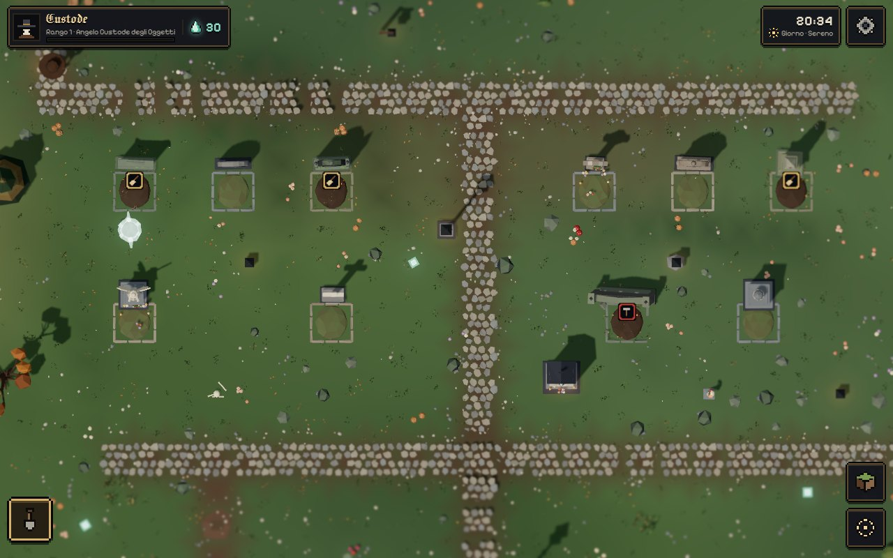
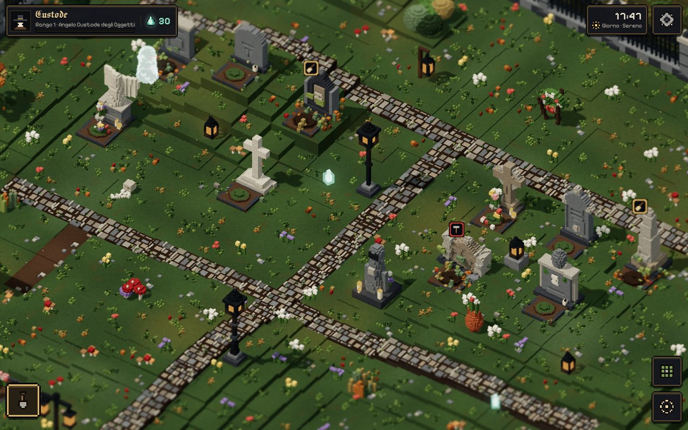
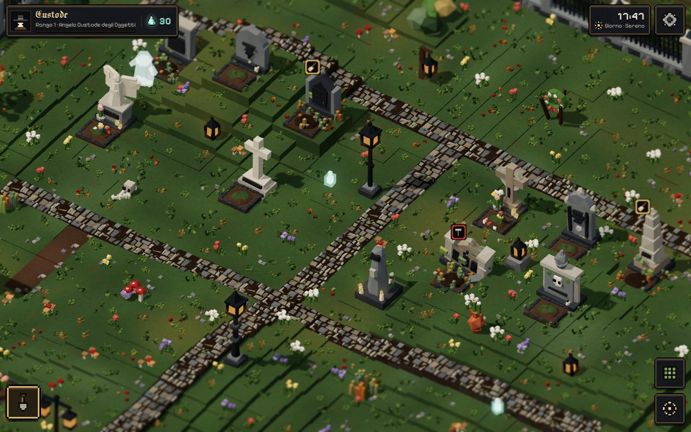
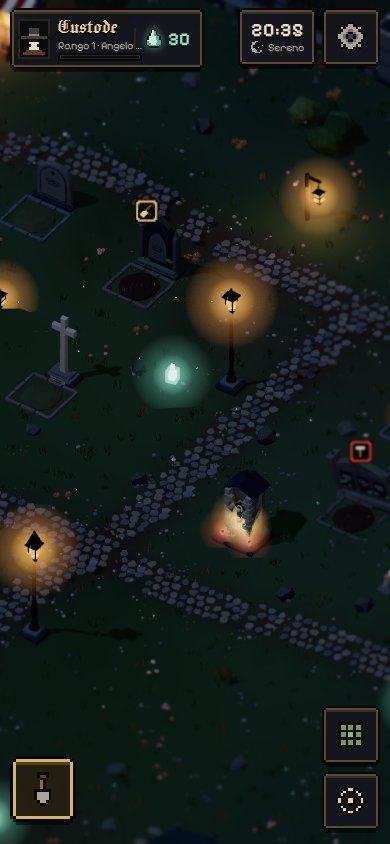
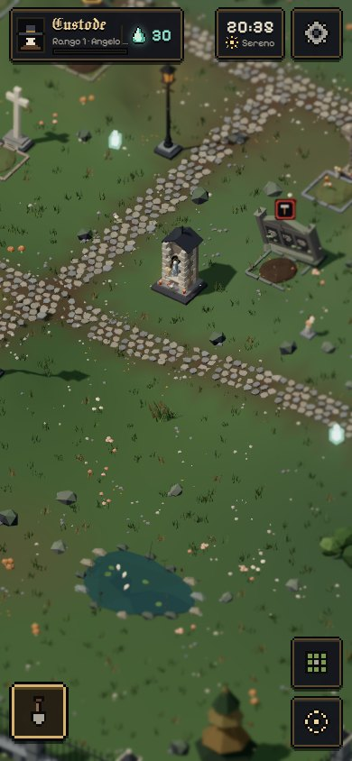
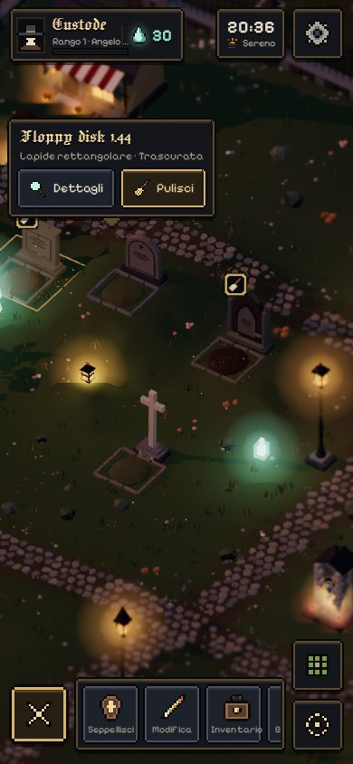
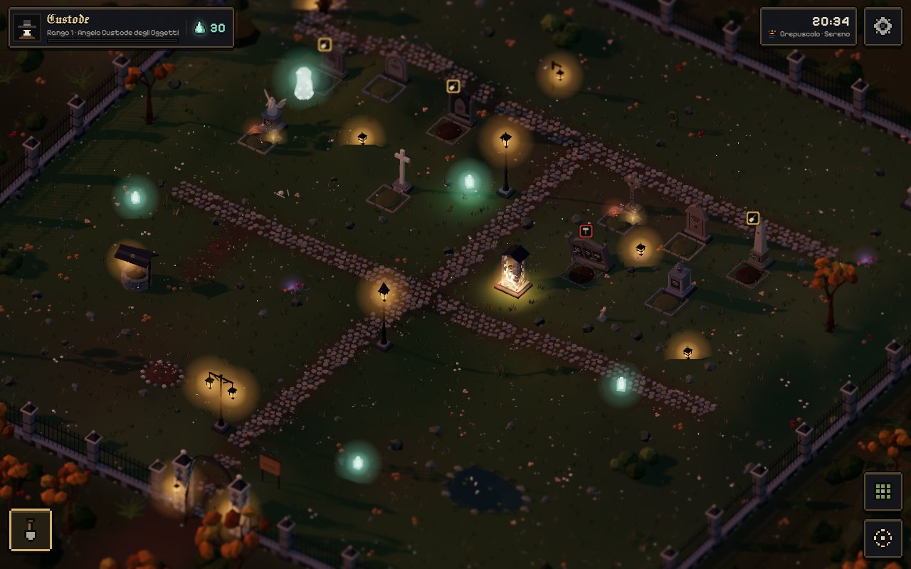
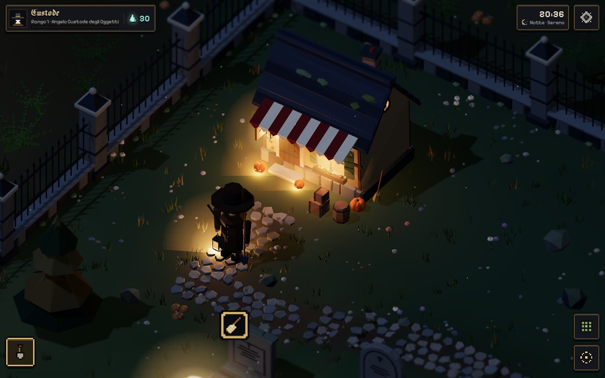

# Necrothing — Prototype 3D

Versione giocabile di Necrothing in 3D, mobile-first, con le stesse dinamiche della
PWA React (`necrothing-docs/prototype/`). È tutto generato dal codice (TypeScript +
Three.js + Vite): non ci sono modelli, texture o immagini esterne.

Tre stili di resa sugli **stessi dati di gioco**: **Gothic Low-Poly** (predefinito,
sfaccettato, materiali opachi e luci calde), **Gothic Voxel** (la resa precedente) e
**Miniatura**. Si cambiano da Impostazioni → Stile, col tasto `V` o con
`?style=lowpoly|voxel|miniature` (alias `?renderer=lowpoly|legacy`).

| Low-Poly · giorno | Low-Poly · notte |
|---|---|
|  |  |

| Low-Poly · dall'alto | Voxel (legacy) · stessa scena | Miniatura · stessa scena |
|---|---|---|
|  |  |  |

| Telefono · notte | Telefono · giorno | Telefono · UI e menù contestuale |
|---|---|---|
|  |  |  |

| Zoom massimo: il cimitero è il protagonista | Dettaglio notturno |
|---|---|
|  |  |

Documentazione della migrazione allo stile low-poly:
[`docs/visual-migration-plan.md`](docs/visual-migration-plan.md) (audit, architettura,
fasi, valutazione voxel vs low-poly vs GLB) e
[`docs/asset-migration-catalog.md`](docs/asset-migration-catalog.md) (stato di ogni asset).

## Avvio

```bash
npm install
npm run dev        # http://localhost:5173  (galleria asset: /gallery.html)
npm test           # 36 test (dominio, rendering voxel, adapter e generatori low-poly)
npm run build      # typecheck + build di produzione in dist/
```

Richiede Node ≥ 22.6 (i test usano `--experimental-strip-types`).
`?seed=717` nell'URL crea una nuova partita con seme fisso (utile per confronti e test);
il salvataggio esistente in `localStorage` ha la precedenza.

## Come si gioca

Sei il **Custode**: un omino col cappello a tesa larga, la pala e una lanterna che
illumina la notte. Tocchi il terreno e cammina lì (A* sulla griglia); tocchi una tomba
o un oggetto e si avvicina, mentre si apre il menù contestuale. Le azioni di cura le
esegue fisicamente (cammina, lavora, poi arriva la ricompensa).

| Dove | Cosa (da `Implementation_Note.md`) |
|---|---|
| In alto a sinistra | Nome, rango con barra di progresso, fuochi fatui → profilo e achievement |
| In alto a destra | Ora reale, fase del giorno e meteo, impostazioni |
| In basso a sinistra | Pala → barra a slot (stile hotbar) che si apre in orizzontale: Seppellisci, Modifica, Inventario, Bottega (centra la mappa sulla bottega), Foto, Galleria |
| In basso a destra | Vista obliqua/dall'alto, ricentra sul Custode |
| Drawer dal basso | Tutte le pagine, con ✕ in alto a sinistra; la bolla sparisce mentre sono aperte |

**Controlli** — Touch: tocca per camminare/selezionare, trascina per spostare la mappa,
pizzica per lo zoom. Desktop: WASD/frecce muovono il Custode, rotella zoom, `E`
interagisci, `C` cambia vista, `V` cambia stile (low-poly → voxel → miniatura), `Esc` chiude.

### Dinamiche (portate dalla PWA, regole in `src/game/`)

- **Sepoltura** in 5 passi (nome+categoria, date+causa, epitaffio, lapide, anteprima),
  poi scegli il posto sulla mappa e arriva il **corteo funebre** (prete, dolenti,
  becchino). Una sola cosa astratta al giorno. Lapidi più ricche sbloccate dal rango.
- **Ciclo delle tombe** (esclusivo): pulita → fiori → dopo 3 giorni appassiscono e la
  tomba è sporca → dopo 10 giorni sporca si **rompe** (riparare costa 6 ✦ e pulisce).
  I fiori si portano solo su una tomba pulita.
- **Luci e costruzioni** si sporcano dopo 3 giorni senza cure e si rompono dopo 7
  (dal foglio Excel); le luci si accendono/spengono, quelle rotte sono spente.
- **Bottega** (pre-piazzata, tutorial al primo avvio, non eliminabile ma spostabile):
  acquisto con quantità, pezzi unici, sblocchi per rango, albero di Natale solo a
  dicembre. **Inventario** per categorie con *Inserisci* / *Vendi* (70%).
- **Modifica**: tocca un elemento, trascinalo (anteprima verde/rossa), ruota, cambia
  variante, riponi in inventario; popup introduttivo con "non mostrare più".
- **Fuochi fatui**: compaiono sulla mappa in funzione di tombe, cure e fiori (la
  benedizione del prete li aumenta per 24 ore); il Custode li raccoglie passandoci.
- **Presenze erranti** dalla matrice di spawn (fantasma, fantasma-oggetto raro, gatto,
  corvo che si posa sulle lapidi, prete, becchino, topo, zombie): si muovono "a torre"
  sugli assi X/Z e cambiano direzione sugli ostacoli; i fantasmi attraversano tutto.
  Toccarle dà XP/✦; il becchino pulisce gratis le tombe vicine. Mausoleo, santuario,
  casa del becchino, bare aperte e buco infernale modificano le probabilità.
- **Presenze piazzabili**: zombie che giocano a carte o ballano, zombie errante,
  fantasmi in girotondo o a palla con un teschio, animali scheletro (cane, gatto,
  coniglio, papera, corvo); la casetta per animali a volte, all'apertura, ha l'animale in tana.
- **Simulazione a tempo reale** all'apertura e al ritorno in primo piano (erbacce,
  sporco, rotture, anniversari, meteo giornaliero) + tick "vivo" ogni 40 s mentre si gioca.
- **Progressione**: 5 ranghi, 27 achievement, prestigio, distretti tematici
  auto-rilevati e **espansione del recinto** per soglie di prestigio (22→44 celle su una
  mappa di 48, mai in calo: il recinto e il cancello si ricostruiscono più grandi).
- **Foto**: rettangolo ridimensionabile dagli angoli + otturatore, scatto in bianco e
  nero della scena, *Salva / Condividi / Elimina*; **Galleria** in IndexedDB.
- **Impostazioni**: stile, vista, qualità (bassa/media/alta), ora del giorno (reale o
  forzata), sfocatura ai bordi, effetti meteo, statistiche tecniche, backup `.necro3d`,
  nuova partita.

### Mondo, camera e resa

- **Gothic Low-Poly** (`src/render/lowpoly/`): generatori dedicati con geometrie vere —
  profili estrusi (lapidi, archi gotici, ali), torniti (vasi, urne, colonne, lampioni),
  box smussati, coni e cilindri a pochi segmenti, icosaedri irregolari — con lievi
  irregolarità deterministiche, colore per faccia e finto AO. Cinque famiglie di lapidi
  sui 10 tipi del gioco, ognuna con varianti per seme e decorazioni modulari per stato
  (fiori, vasi, corone, candele accese, muschio, erbacce, foglie, crepe, frammenti).
  Edifici con finestre gotiche illuminate, porte ad arco, tetti a lastre, cantonali;
  recinto con inferriata a lance; selciato fitto a pietre poligonali con bordi sfumati
  nel prato (erba bassa e sassolini); terreno morbido senza poligoni a vista; sassi e rocce sparsi; personaggi con le
  stesse parti del rig (Custode con cappello, lanterna e pala; scheletro; fantasma).
  Edifici in chiave "cozy spooky" (case storte con travi a vista, tetti muschiati,
  lanterne, edera, zucche intagliate), edicola votiva e angelo piangente, e **tutto il
  catalogo** (51 oggetti) più gli animali con un generatore dedicato.
  Materiali `MeshStandardMaterial` opachi a flat shading; il fallback *miniatura* resta
  come rete di sicurezza per asset futuri. Ogni luce tremola con un
  `FireFlicker` indipendente e deterministico.

- **Il cimitero è il protagonista**: mappa logica 64×64, recinto iniziale **34×34** che
  cresce fino a 58×58; il bosco è solo una cornice (12 celle oltre la mappa) e la camera
  ne mostra una fascia sottile: zoom massimo = recinto + ~7 celle, pan = recinto + 3.
  Il cimitero iniziale ha 10 tombe di tutte le famiglie e in tutti gli stati, viali in
  selciato, bottega, statue, pozzo, stagno, aiuola, lampioni e lanterne.
- **Dislivelli e collinette**: colline morbide deterministiche dentro il recinto
  (piatte lungo il muro di cinta), terreno che sale nel bosco; sotto ogni oggetto un
  **pad** piano, così tombe ed edifici non pendono e i sentieri seguono il terreno.
  Personaggi, fuochi fatui e tocco sul terreno usano la quota reale del suolo.
- **Niente terreno "flottante"**: la camera calcola l'impronta inquadrata (ortografica,
  40° di elevazione, ruotata) e limita zoom massimo e pan perché il bordo del terreno non
  entri mai nello schermo.
- **Sfocatura tilt-shift ai bordi** (qualità media/alta, disattivabile): due passate
  separabili a raggio variabile; la fascia nitida segue il Custode o l'oggetto selezionato,
  il resto sfuma come in un diorama fotografato da vicino.
- **Voxel più fini**: 16 voxel per cella a qualità media (10 in bassa, 20 in alta) invece
  di 10, con greedy meshing (facce coplanari fuse) e variazione di colore per singolo voxel
  nello shader. Erba a fili sottili, fiorellini, acciottolato irregolare con fughe e
  muschio, licheni ed erba alla base delle lapidi.
- **UI nello stile del gioco**: cornici pixel con angoli a gradino (SVG generati, nitidi a
  ogni scala), icone pixel-art 12×12 disegnate con la stessa palette dei voxel (anche i
  badge 3D 🧹/🛠 sono diventati targhette pixel), *Pixelify Sans* per il testo e
  *Jacquard 24* (gotico pixelato) per titoli e nomi; ombre nette e animazioni a scatti.
  I font sono inclusi via `@fontsource` (funzionano offline).

## Architettura

```text
src/
├── game/        dominio puro (nessun three/DOM): stato, regole, simulazione, spawn,
│                catalogo (dall'Excel), progressione, mondo/occupazione — testato
├── render/      DSL di forme + due mesher + cache + modelli procedurali
│   ├── shape.ts           primitive in unità voxel (box, cilindro/cono, ellissoide,
│   │                      prisma-tetto, arco, scavo) con trasformazioni
│   ├── voxelMesher.ts     griglia di voxel → facce visibili + AO per vertice
│   ├── lowpolyMesher.ts   stesse primitive → solidi sfaccettati irregolari
│   ├── modelCache.ts      geometrie condivise per (modello, stato, stile)
│   └── models/            tombe, luci, decorazioni, costruzioni, natura, recinto
├── view/        scena: WorldView (sync con lo stato), terreno a chunk con texture,
│                ChunkBaker (bosco/sottobosco cotti per chunk), Atmosphere (fasi del
│                giorno, meteo, ombre, pool di luci), CameraRig (vincoli sul bordo del
│                mondo), PostFX (tilt-shift), Actors (Custode, presenze, funerale, A*),
│                personaggi a parti, effetti
├── ui/          HUD, bolla, menù contestuale, drawer e schermate, miniature 3D,
│                icons.ts (icone pixel-art e cornici a 9 fette)
└── app/         Game (controller), Input (gesti/tastiera), persistenza
```

- **Una definizione, due rese.** Ogni asset è una lista di primitive in voxel
  (`ModelBuilder`). Il mesher voxel le rasterizza in cubetti con occlusione ambientale
  (rasterizzazione conservativa per sbarre e aste sottili); il mesher *miniatura* le
  trasforma in solidi low-poly con vertici irregolari e colore per faccia. Dimensioni e
  pivot coincidono (testato). Cambiare stile (`V`) ricostruisce solo le mesh: posizioni,
  stati, selezione e Custode restano dove sono.
- **Camere ortografiche vere**: obliqua a 40° di elevazione; *dall'alto* esattamente
  lungo −Y (testato). Per la leggibilità dall'alto ci sono targhette pixel (scopa/martello)
  sugli oggetti da curare, cornice di selezione e aloni delle luci.
- **Luci**: ogni sorgente ha voxel emissivi e un alone additivo (economici); un pool
  fisso di PointLight (4/7/10 per qualità) viene assegnato alle sorgenti più vicine al
  centro della vista, senza ricompilare gli shader. Una sola luce direzionale con ombra
  che segue la camera.
- **Prestazioni** (SwiftShader, qualità media, stessa scena): low-poly ~600k triangoli
  e ~320 draw call su desktop, ~520k su telefono; voxel ~790k; miniatura ~410k.
- **Ottimizzazioni**: geometrie condivise e cache; recinto in `InstancedMesh`; bosco e
  sottobosco *cotti* in una geometria per chunk 12×12 (frustum culling per zona) con LOD
  (alberi lontani a risoluzione voxel ridotta); terreno a chunk con greedy meshing delle
  sommità. Misure nel browser headless con rendering software (SwiftShader, FPS non
  indicativi), qualità media: telefono 390×844 ~190 draw call e ~630k triangoli in voxel;
  desktop 1280×800 ~250 draw call, ~930k triangoli in voxel e ~410k in miniatura; allo
  zoom massimo ~1,3M triangoli. La qualità bassa riduce voxel, densità del bosco e
  sottobosco, e spegne la sfocatura.

## Asset dall'Excel

Il catalogo (`src/game/catalog.ts`) segue il foglio *Asset for Necrothing con
dimensioni Procreate*: 8 luci, 7 decorazioni, 17 costruzioni, 13 elementi
d'ambiente, 6 presenze, più le 10 lapidi della PWA. L'ingombro dell'Excel era quello
dello sprite 2D top-down; in 3D è stato convertito in **ingombro a terra** (es.
lampione 2×3 → 1×1 alto, albero con candele 4×4 → 3×3). Le varianti "(x 3)", "(x 2)"
e gli animali sono varianti selezionabili in Modifica. Stati gestiti: acceso/spento,
sporco, rotto, luci notturne; tombe pulite/con fiori/sporche/rotte.

### Aggiungere un asset

1. Aggiungi la voce in `src/game/catalog.ts` (id, categoria, ingombro, costo, rango,
   flag `decays`/`light`/`rotatable`/`walkable`/`variants`).
2. Scrivi il modello in `src/render/models/*.ts` con `ModelBuilder` (misure in voxel:
   10 per cella, origine al centro dell'ingombro a terra, fronte verso +z) e usa
   `decay()` per gli stati sporco/rotto; `b.light(...)` per le sorgenti luminose.
3. Registralo in `BUILDERS` (`src/render/models/registry.ts`).
4. (Low-poly) scrivi il generatore in `src/render/lowpoly/*` con `LP` e registralo in
   `LP_PLACEABLES` (`src/render/lowpoly/index.ts`); senza generatore l'oggetto usa la
   resa miniatura.
5. Controllalo in `/gallery.html?style=lowpoly` (anche `voxel`, `miniature`); `npm test`
   verifica che stia nell'ingombro e che le luci spente non emettano.

## Test

`npm test` — 36 test: nuova partita valida, migrazione dei salvataggi v1, sepoltura e limite astratto, ciclo
fiori/sporco/rotto, decadimento 3/7 giorni, bottega e vendita, modifica/rotazione/
riponi, becchino, modificatori di spawn, determinismo, espansione monotona,
achievement, distretti, catalogo; determinismo del mesher, parità dimensioni
voxel/miniatura, tutte le lapidi × stati, ogni voce del catalogo in ogni stato,
rasterizzazione conservativa, camera perpendicolare, stato invariato al cambio stile;
**low-poly**: adapter chiave → generatore per ogni lapide × stato, determinismo e
varianti per seme, stati che cambiano la geometria, ingombri degli oggetti migrati,
luci accese/spente, fallback e materiali per stile, parti dei personaggi, scenografia,
terreno (colline, pad piani, continuità), limiti della camera, FireFlicker.
Inoltre gli scenari di interazione sono stati verificati con Playwright (tap → menù →
pulizia, sepoltura + funerale, bottega, inventario → posa, trascinamento in Modifica,
foto → galleria).

## Rapporto con il resto del repository

- `necrothing-docs/prototype/` (PWA React/SVG) resta intatta: è la fonte delle regole.
  Qui le regole sono **riscritte come funzioni pure** (nessuna dipendenza da IndexedDB/
  React), con gli stessi numeri (`src/game/balance.ts`).
- Il salvataggio è locale (`localStorage` + IndexedDB per le foto), separato dalla PWA.

## Limiti noti

- Prestazioni misurate solo con rendering software: vanno verificate su telefoni reali
  (i voxel più fini e il bosco esteso hanno alzato il conto dei triangoli; se serve, la
  qualità bassa o un LOD più aggressivo per il sottobosco lo riducono).
- In voxel gli alberi lontani usano una risoluzione ridotta, ed erba e ciottolato non
  possono scendere sotto la dimensione di un voxel: è il limite della resa voxel, per
  questo lo stile predefinito è ora il low-poly.
- Le notifiche push sono rimandate all'app nativa (Capacitor); nel browser la
  simulazione recupera il tempo trascorso alla riapertura.
- Nessun audio. La pathfinding è su griglia (niente evitamento dinamico tra personaggi).
- Lo stile *Miniatura* è derivato dalle stesse primitive: alcune incisioni diventano
  lastre scure e i tagli strutturali (scheggiature) non vengono resi.

## Prossimi passi

1. Fumo dai comignoli, scintille e fiamme animate; valutare asset eroi in GLB (vedi
   piano di migrazione).
2. Profilazione su iOS/Android e taratura delle soglie di qualità.
3. Audio (ambiente notturno, campane, corvi) con rispetto del mute.
4. Capacitor: notifiche native per anniversari/erbacce, salvataggio su SQLite.
