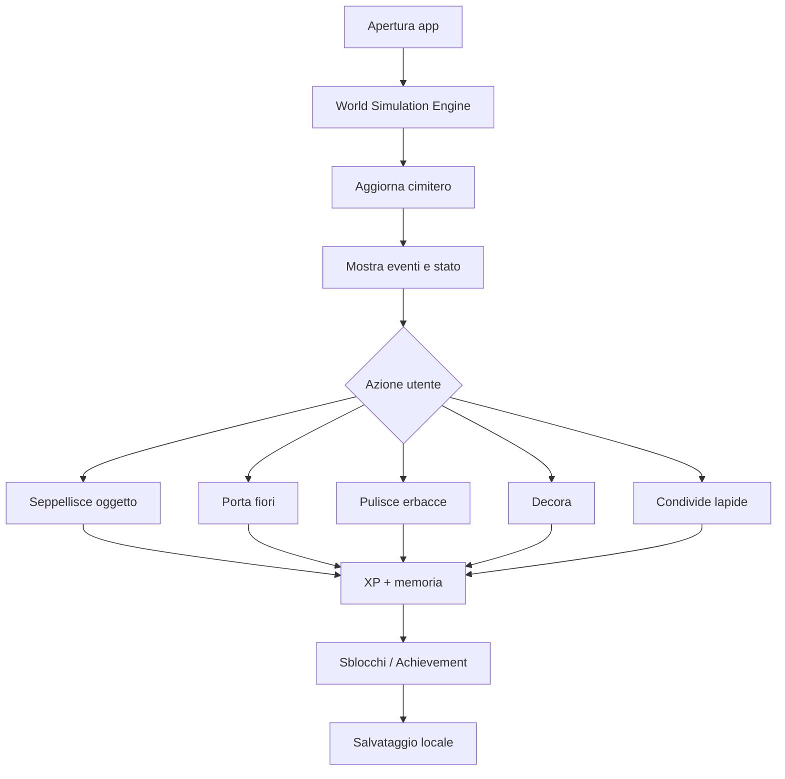

# Core Gameplay Loop

Versione: `v0.1`

## Loop primario

## Loop giornaliero

1. Apri il cimitero.
2. Scopri cosa è cambiato.
3. Risolvi piccoli eventi.
4. Ricevi XP o badge.
5. Personalizza o commemora.
6. Chiudi l'app con il mondo aggiornato.

## Loop a lungo termine

- Aggiungi tombe.
- Completa collezioni.
- Sblocca zone.
- Aumenta il prestigio.
- Evolvi lapidi in mausolei.
- Costruisci un cimitero unico.

## Rischio da evitare

Il loop non deve diventare una lista di faccende ripetitive. Gli eventi devono essere leggeri, opzionali e narrativi.
