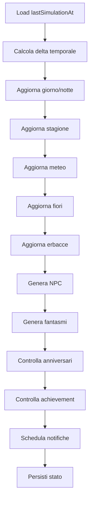

# World Simulation

Versione: `v0.1`

## Obiettivo

Il cimitero deve sembrare vivo senza usare processi background continui.

La simulazione viene eseguita principalmente:

- all'apertura dell'app;
- al ritorno in foreground;
- dopo azioni rilevanti dell'utente;
- prima della schedulazione notifiche.

## Pipeline

## Regole

- Nessun evento deve obbligare l'utente a intervenire immediatamente.
- Gli eventi devono essere deterministici quanto basta da evitare incoerenze.
- Gli eventi casuali devono usare seed salvato per debug e riproducibilità.

## Meteo

- Sereno cupo
- Nebbia
- Pioggia
- Temporale
- Vento
- Neve
- Luna piena

## Ciclo giorno/notte

Basato sull'ora locale del dispositivo.

Di notte aumentano:

- candele visibili;
- fuochi fatui;
- probabilità fantasmi;
- occhi rossi degli animali.

## Stagioni

- Primavera: fiori più frequenti.
- Estate: vegetazione secca.
- Autunno: foglie e Halloween.
- Inverno: neve e candele festive.
