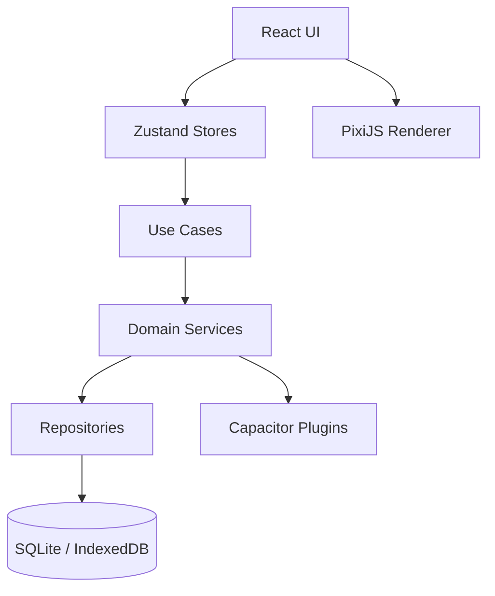

# Technical Architecture

Versione: `v0.1`

## Stack

| Area | Tecnologia |
|---|---|
| App | PWA |
| Native wrapper | Capacitor |
| Frontend | React + TypeScript |
| Bundler | Vite |
| Rendering 2D | PixiJS |
| State | Zustand |
| Routing | React Router |
| Native DB | SQLite via Capacitor plugin |
| Web fallback | IndexedDB |
| File system native | Capacitor Filesystem |
| Notifiche | Capacitor Local Notifications |
| Export | ZIP `.necro` |
| Test | Vitest + Testing Library + Playwright |

## Principi architetturali

- Feature-first folder structure.
- Componenti React solo per UI e orchestrazione.
- Logica di dominio nei servizi/use case.
- Accesso dati tramite repository.
- Nessun accesso diretto al database dai componenti.
- Tutte le stringhe devono essere localizzabili.
- Nessun analytics esterno.

## Struttura prevista codice

```text
src/
├── app/
├── features/
│   ├── cemetery/
│   ├── graves/
│   ├── burial/
│   ├── decorations/
│   ├── progression/
│   ├── notifications/
│   ├── simulation/
│   └── sharing/
├── shared/
│   ├── components/
│   ├── services/
│   ├── db/
│   ├── storage/
│   ├── hooks/
│   └── utils/
└── assets/
```

## Livelli


