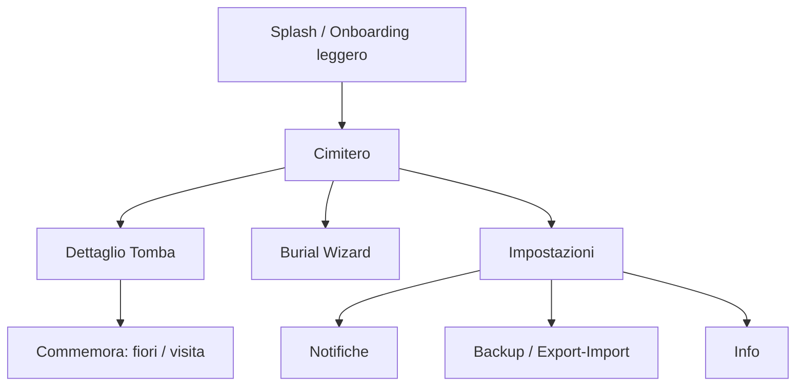

# UX Structure

Versione: `v0.1`

## Principi UX

- **Mobile-first**: progettato per viewport stretti e interazione touch.
- **Una mano**: azioni primarie raggiungibili nella metà inferiore dello schermo.
- **Zero tutorial lunghi**: tocca una zolla, seppellisci, commemora, decora.
- **Niente attenzione mendicata**: nessun popup aggressivo, nessun marketing.

## Mappa schermate

## Schermate

### Cimitero (home)

- Scena SVG con griglia di celle, pan/zoom touch.
- Top bar minima: rango + barra XP + meteo/stagione.
- Bottom bar: azione principale "Seppellisci", accesso impostazioni.
- Tap su cella vuota → Burial Wizard. Tap su tomba → Dettaglio.
- Indicatori di stato sulle tombe: erbacce, fiori appassiti, anniversario.

### Burial Wizard

- Flusso a step (FEATURE-001): nome → categoria → date → causa → epitaffio → foto → conferma.
- Navigazione avanti/indietro, annulla senza salvare dati parziali.
- Step a tutto schermo su mobile; validazione inline.

### Dettaglio Tomba

- Lapide grande, nome, epitaffio, date, causa.
- Timeline `GraveMemoryEvent` (sepoltura, fiori, anniversari, eventi).
- Azioni: porta fiori, pulisci erbacce, decora, condividi (P1).

### Impostazioni

- Notifiche (globale, per categoria, quiet hours).
- Backup/export-import `.necro`.
- Info app, versione, privacy.

## Navigazione

- Routing client-side (React Router).
- Nessuna navigazione che perda dati non salvati senza conferma.
- Back hardware (Android/Capacitor) coerente con lo stack di navigazione.

## Layout & breakpoints

| Breakpoint | Larghezza | Comportamento |
|---|---|---|
| Mobile | < 600px | Primario. Bottom bar, step a tutto schermo, scena full-width. |
| Tablet | 600–1024px | Scena più ampia, modali centrate. |
| Desktop | > 1024px | Scena con margini, pannelli laterali per dettaglio. |

## Accessibilità

- Target touch minimi 44×44px.
- Contrasto adeguato anche con tema gothic scuro.
- Testi alternativi per asset SVG significativi.
- Rispetto di `prefers-reduced-motion` per le animazioni.

## Tono visivo

- Gothic, notturno, ironico.
- Palette scura con accenti (verde muschio, viola spettrale, ambra candela).
- Animazioni leggere e narrative, mai invadenti.
