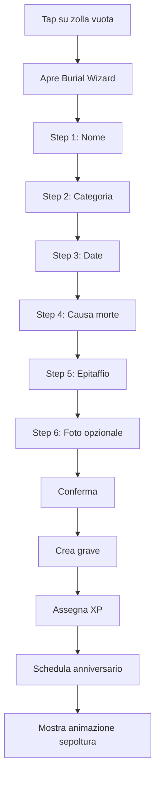

# Feature Spec: Burial Flow

ID: `FEATURE-001`
Versione: `v0.1`
Priorità: `P0`

## Obiettivo

Consentire all'utente di creare una nuova tomba per un oggetto morto.

## User Story

Come utente, voglio seppellire un oggetto rotto o simbolicamente morto, così da trasformarlo in una tomba all'interno del mio cimitero.

## Flow

## Campi

| Campo | Tipo | Obbligatorio |
|---|---|---|
| name | string | sì |
| category | enum | sì |
| birthDate | date | no |
| deathDate | date | sì |
| deathCause | enum/string | sì |
| epitaph | string | no |
| photoId | string | no |
| graveType | enum | sì |
| gridX | number | sì |
| gridY | number | sì |

## Validazioni

- `name`: 1-80 caratteri.
- `epitaph`: massimo 240 caratteri.
- `deathDate`: non futura.
- `birthDate`: se presente, deve essere precedente o uguale a `deathDate`.
- `gridX/gridY`: cella libera.

## Acceptance Criteria

- L'utente può completare il wizard senza foto.
- L'utente può annullare il wizard senza salvare dati parziali.
- Una nuova tomba appare nella griglia dopo conferma.
- Gli XP vengono aggiornati correttamente.
- L'anniversario viene schedulato se le notifiche sono abilitate.
- Il record viene persistito nel database locale.
- L'operazione funziona offline.

## Componenti coinvolti

- `BurialWizard.tsx`
- `BurialStepName.tsx`
- `BurialStepCategory.tsx`
- `BurialStepDates.tsx`
- `BurialStepCause.tsx`
- `BurialStepEpitaph.tsx`
- `BurialStepPhoto.tsx`
- `GraveSprite.tsx`

## Servizi coinvolti

- `GraveService`
- `ProgressionService`
- `NotificationService`
- `ImageStorageService`
- `WorldSimulationService`

## Test richiesti

- validazione campi;
- creazione tomba;
- cella occupata;
- assegnazione XP;
- scheduling anniversario;
- salvataggio offline.
